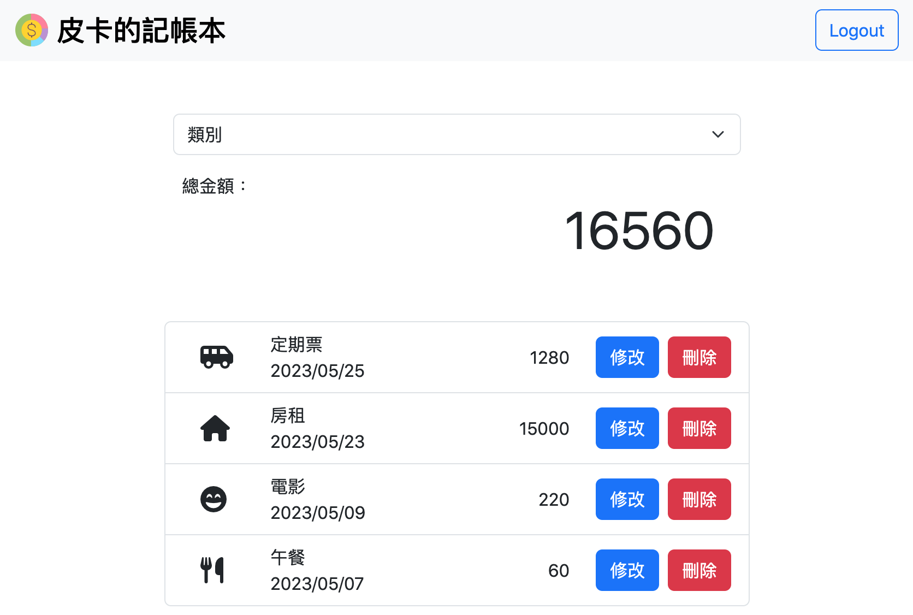

# 家庭記帳本

可管理多位家庭成員的支出明細




## Prerequisites

* Node.js
* Express @4.18.2
* Express-handlebars @4.0.2
* express-session @1.17.1
* method-override @3.0.0
* mongoose @7.0.3
* passport @0.4.1
* dotenv @16.0.3


## Installing

1. 安裝套件

```
npm install
```

2. 安裝 Nodemon 至全域 (若有安裝過可省略)
```
npm install -g nodemon
```

3. 啟動！(`ctrl+c` 可停止)
```
npm run dev
```

4. 可添加種子資料 (`ctrl+c` 可停止)
```
npm run seed
```

5. 新增 `.env` 檔案填入必要環境資訊


## Authors

* **Susan Lin** - *Initial work* - [Suz033](https://github.com/Suz033)
